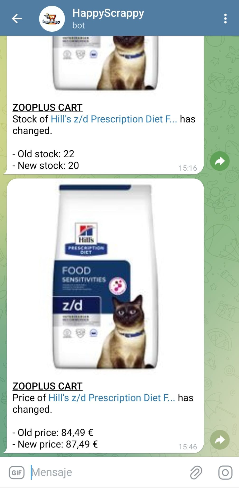

# Happy Scrappy 


## Description
- HappyScrappy actively monitors your online shopping carts, updating in real-time. It notifies you whenever there are changes in key product attributes such as "stock" and "price."
-----
## Working platforms:
- **Amazon**: Monitors your *Amazon Cart* and *Amazon Saved For Later* section, if the price of any product changes, it notifys you via the *Notification Platforms*.


- **Zalando**: Keeps an eye on your *Zalando Cart*. It alerts you via the *Notification Platforms* if there are changes in price and maximum availability/stock.


- **Zooplus**: Monitors your *Cart* section updating in real-time. Notifies you when the *price* or *stock* of any of your cart products changes.


----
## Notification Platforms
- **Telegram Bot**: Introduce your BOT TOKEN and CHAT ID in the `.env`. 
(https://core.telegram.org/bots/tutorial / https://gist.github.com/nafiesl/4ad622f344cd1dc3bb1ecbe468ff9f8a)

 ----
## Requirements
```bash
sudo apt update
sudo apt install nodejs npm
```
----
## Installation
- `git clone https://github.com/kpk000/HappyScrappy`

### Linux/RaspberryOS
*Due to some errors executing Puppteer on Unix OS, you must follow this guide to avoid errors.*
- Execute the following commands
```bash
cd ./HappyScrappy
sudo apt install chromium-browser chromium-codecs-ffmpeg
sudo apt-get install npm
sudo npm install puppeteer-core@v1.11.0
sudo npm install
```

### Windows
- `cd ./HappyScrappy`
- `npm install`
- Go to [zalando.js](./zalando/zalando.js),[amazon.js](./amazon/amazon.js),[zooplus.js](./zooplus/zooplus.js) files.
- Delete for each file the line `executablePath: "/usr/bin/chromium-browser", //Delete this in Windows OS`, this line is to avoid errors executing in Unix Systems.
----
## Setup
- Create a `.env` file in the source directory.
- Write for each of this variables the ones that you are gona use:
```
TELEGRAM_BOT_TOKEN=
TELEGRAM_BOT_ID= 

AMAZON_EMAIL= 
AMAZON_PASSWORD= 

ZALANDO_EMAIL=  
ZALANDO_PASSWORD= 

ZOOPLUS_EMAIL= 
ZOOPLUS_PASSWORD= 
```
- Make sure the credentials are valid. 
-----
## Usage
*HappyScrappy can be used in two ways*

#### Node js
- `node ./happyScrappy.js  --amazon --zalando --zooplus`
- Each argument is the scrapper that the main script `happyScript` is going to run. Delete the one that you don't need.
- The main script has a functionality in which if one thread is terminated, all are terminated, this facilitates the integration with PM2, as we will see below.
- This is not the correct way to run it, but it can be used for testing.

#### PM2 (recommended way)
*PM2 PM2 is an advanced process manager for NodeJS, it takes care of things like picking up scripts if they crash (that's why the tool is configured to kill all scripts if one crashes, so PM2 will instantiate them all), monitor them, run them when the system turns on...*
- `sudo npm install pm2@latest -g`

- Execute the tool from *command line*:
```node
pm2 start happyScript.js --  --amazon --zalando --zooplus
```
- Each argument is the scrapper that the main script `happyScript` is going to run. Delete the one that you don't need.

-  Execute the tool from the *PM2 config file* [ecosystem.config.cjs](ecosystem.config.cjs).
- More about it's configuration: https://pm2.keymetrics.io/docs/usage/application-declaration/
- When you end the *config* configuration, execute it:
`pm2 start ecosystem.config.cjs`

-----
### Quick PM2 Guide
1. Start an Application
- To start a script:
```
pm2 start app.js
```

- To start and name your process (useful for later identification):
```
pm2 start app.js --name "my-app"
```

2. List Running Applications
- To list all processes managed by PM2:
```
pm2 list
```
3. Monitor Processes

- To monitor and see logs, CPU, and memory usage of all processes:
```
pm2 monit
```
4. Stop a Process
- To stop a process without removing it from PM2's list:
```
pm2 stop <app_name_or_id>
```
5. Restart a Process
- To restart a specific process:
```
pm2 restart <app_name_or_id>
```

6. Delete a Process
- To stop and remove a process from PM2’s management list:
```
pm2 delete <app_name_or_id>
```
7. Reload
- To reload a process gracefully (zero downtime if supported by your app):
```
pm2 reload <app_name_or_id>
```
8. View Logs
- To view combined logs of all processes:
```
pm2 logs
```
- To view logs for a specific process:
```
pm2 logs <app_name_or_id>
```
9. Startup Script
- To generate a startup script to resurrect PM2 and all processes on boot:
```
pm2 startup
```
 

  


