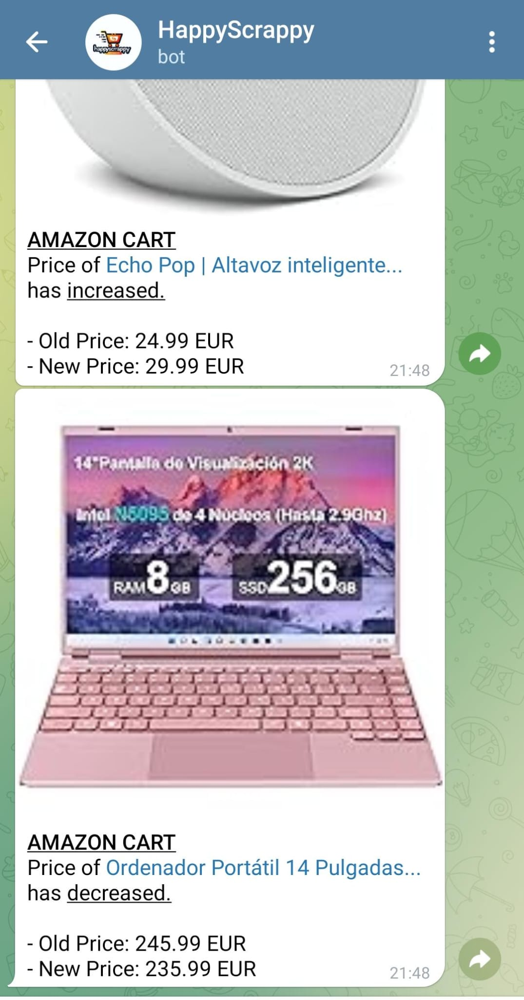
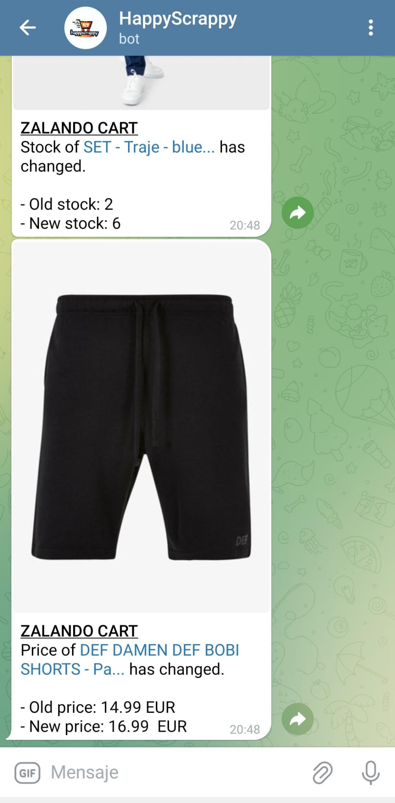

# Happy Scrappy 

## Description
- HappyScrappy actively monitors your online shopping carts, updating in real-time. It notifies you whenever there are changes in key product attributes such as "stock" and "price."

## Working platforms:
- **Amazon**: Watchs your *Amazon Cart* and *Amazon Saved For Later* section, if the price of any product changes, it notifys you via the *Notification Platforms*.

- **Zalando**: Keeps an eye on your *Zalando Cart*. It alerts you via the *Notification Platforms* if there are changes in price, maximum availability, or stock.

## Notification Platforms
- **Telegram Bot**: Introduce your BOT TOKEN and CHAT ID in the `.env`.

  

